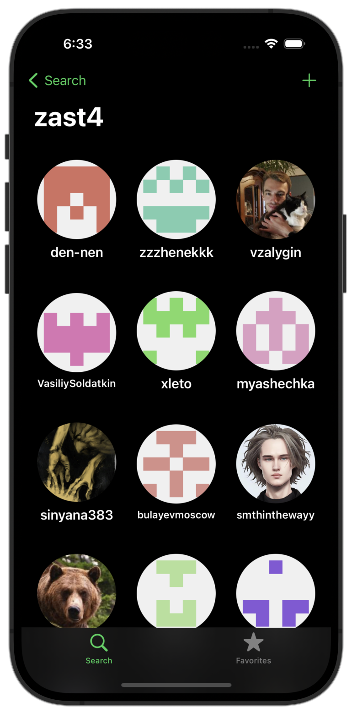
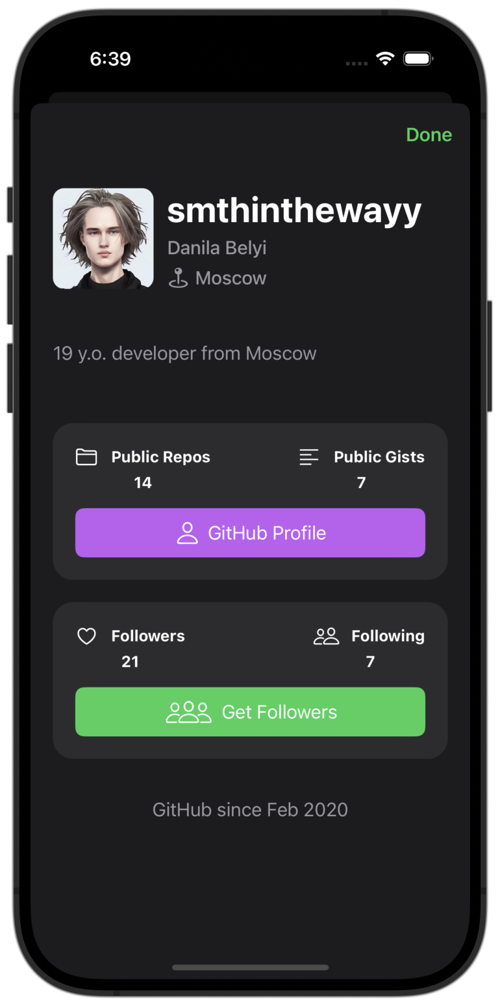
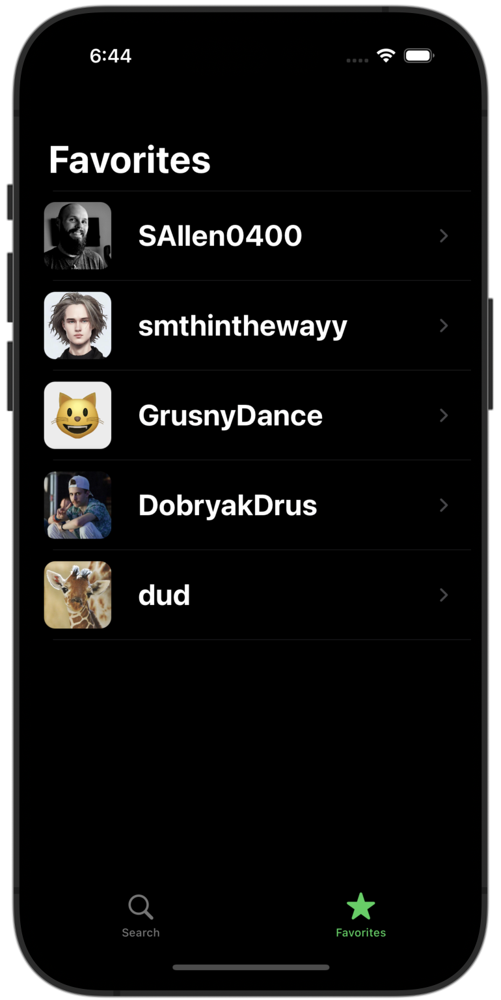
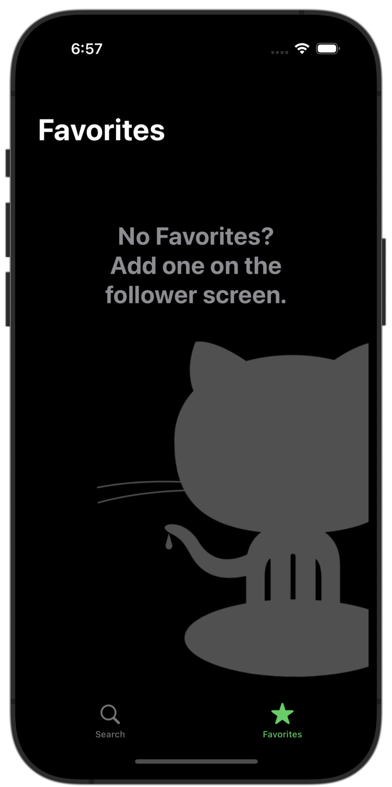
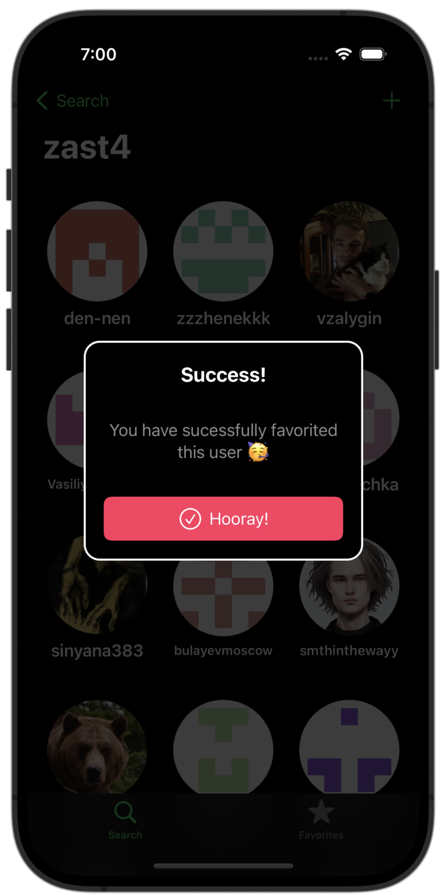
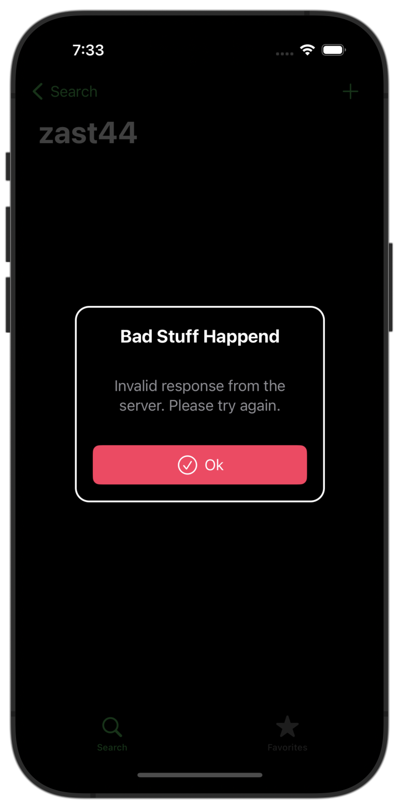
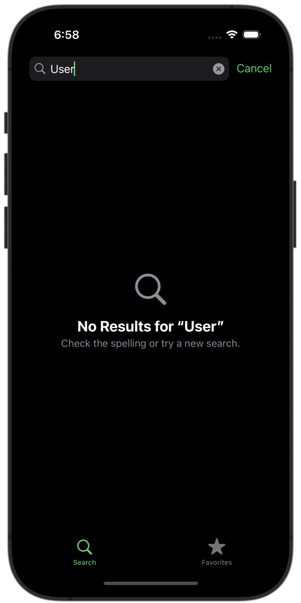

#  GitHubFollowers

## Main screens
Search screen                |  Followers list screen | User info screen |
:-------------------------:|:-------------------------:|:-------------------------:|
 |  | 

## Favorites 
Favorites                |  Empty favorites | Add to favorites
:-------------------------:|:-------------------------:|:-------------------------:|
  |   |   

## Errors and empty states

User does not exist                |  User not found | Empty favorites
:-------------------------:|:-------------------------:|:-------------------------:|
  |   | 

## User flow
 

## Features
* 100% programmatic UI
* No 3rd Party Libraries
* Codable to parse JSON
* Memory management
* Caching images
* Pagination
* Empty States
* Handling Errors
* Collection Views with Diffable Data Source
* Search Controller
* Composition & avoiding massive view controllers
* Child View Controllers
* Dark/Light themes
* Persistence
* Storing favorites
* Dynamic Type
* SFSymbols
* Delegates/Protocols
* Project Organization